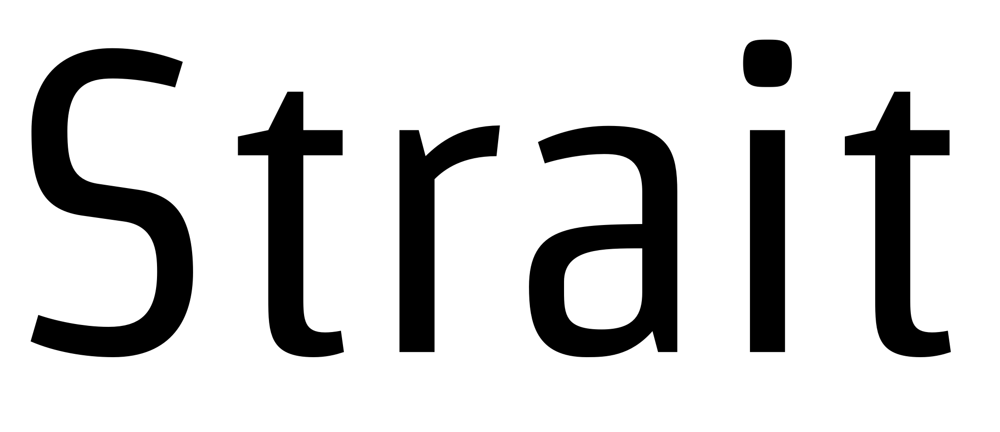
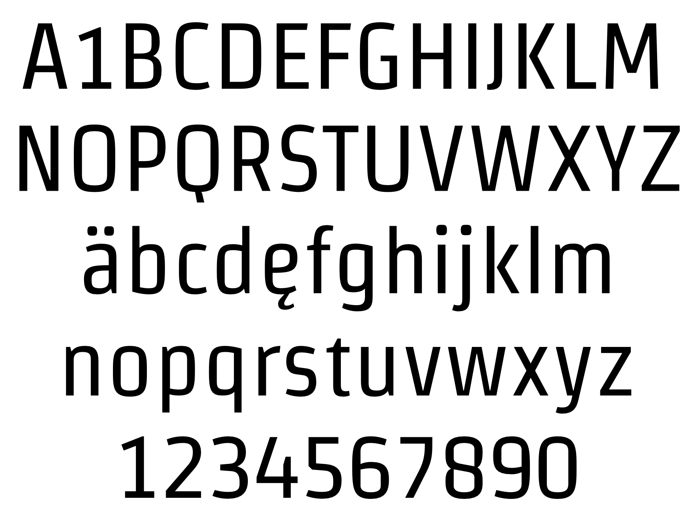

### Strait

When the space available is small, Strait becomes very useful. A great quality condensed typeface that is suitable for both display and text usage, and with excellent reading performance at 12 point size.

### Designer

* Eduardo Rodríguez Tunni

### License

Licensed under the [*SIL Open Font License, 1.1*](https://scripts.sil.org/OFL); you may not use this file except in compliance with the License.

To contribute to the project contact Eduardo Rodríguez Tunni > edu@tipo.net.ar
